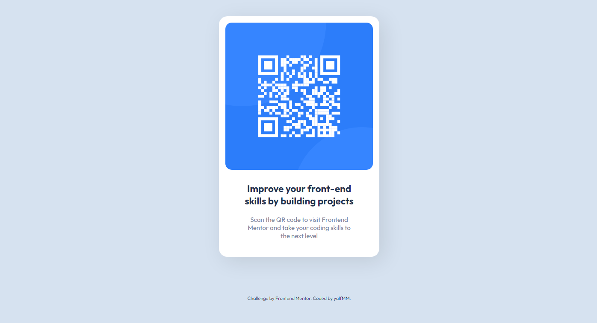

# Frontend Mentor - QR code component

## Hello! 👋

Here is a solution to [QR Code Component on Frontend Mentor](https://www.frontendmentor.io/challenges/qr-code-component-iux_sIO_H). Frontend Mentor challenges help you improve your coding skills by building realistic projects. 

### Screenshot

## Process

### What I learned

- Basic positioning in html and CSS

### Built with

- Semantic HTML5 markup
- CSS custom properties
- Responsive Design

## Author

- Website - [github/yalfmm](https://github.com/yalfmm)
- Frontend Mentor - [@yalfmm](https://www.frontendmentor.io/profile/yalfmm)